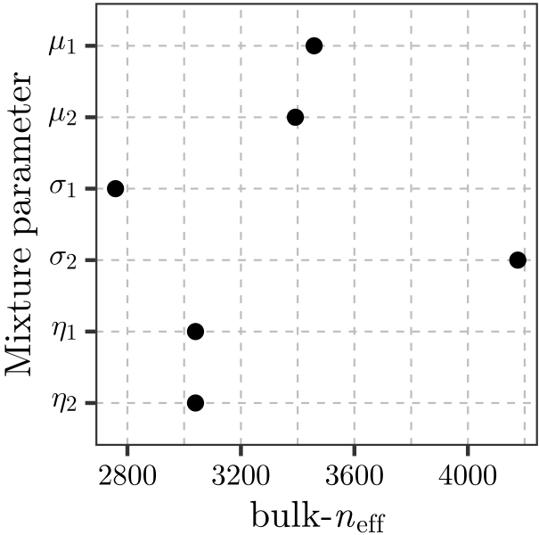

# Styling R ggplot2 graphics with LaTeX

 

This repository holds digital resources associated with the article "Styling R
ggplot2 graphics with LaTeX" [[1](#references)]. ggplot2 is a popular graphics
package used with the R statistical programming language. That article
demonstrates supplementing ggplot2's native styling options with LaTeX.
Applying Greek letters, italicised text and subscripts to a scatterplot, was
used an illustrative example.

---

<figure>
  
  <figcaption>Figure 1. Example scatterplot of mixture parameter versus bulk effective sample size, for Markov Chain Monte Carlo mixture modelling. The plot was composed in R with ggplot2. The y-axis tick mark labels and x-axis label were then styled using LaTeX. Adapted from [<a href="#references">1</a>].</figcaption>
</figure>

---

## Table of Contents

- [Key Files](#key-files)
- [Software Requirements](#software-requirements)
- [Acknowledgements](#acknowledgements)
- [References](#references)

## Key Files

| File                          | Notes     |
| :---------------------------- | :-------- |
| `src/latex-styling-ggplot2.R` | R script. |

## Software Requirements

- Ghostscript 10.00.0. 
- R. 
- An R IDE, e.g., RStudio (optional). 

N.B. The code was not designed for use with Ghostscript more recent than version 10.00.0.

### R Configuration

Please ensure the R installation has the following packages installed:

- egg
- extrafont
- ggplot2
- gridExtra
- knitr
- latex2exp

Detailed system configuration details are provided in [<a href="#references">1</a>].

## Acknowledgements

This work was supported by the Australian Research Council Training Centre in
Data Analytics for Resources and Environments (project ICI9010031) and
Australian National Health and Medical Research Council Ideas Grant GNT1186572.

## References

1. T. Stenborg, "Styling R ggplot2 graphics with LaTeX", _TUGboat_, vol. 44,
   no. 1, pp. 108&ndash;109, Apr. 2023,
   doi: 10.47397/tb/44-1/tb136stenborg-ggplot2.\
   [View PDF](https://tug.org/TUGboat/tb44-1/tb136stenborg-ggplot2.pdf) &nbsp;
   [View at publisher](https://tug.org/TUGboat/tb44-1/tb136stenborg-ggplot2.html)
   &nbsp; [SciX](https://scixplorer.org/abs/2023TUGbt..44..108S/abstract)
